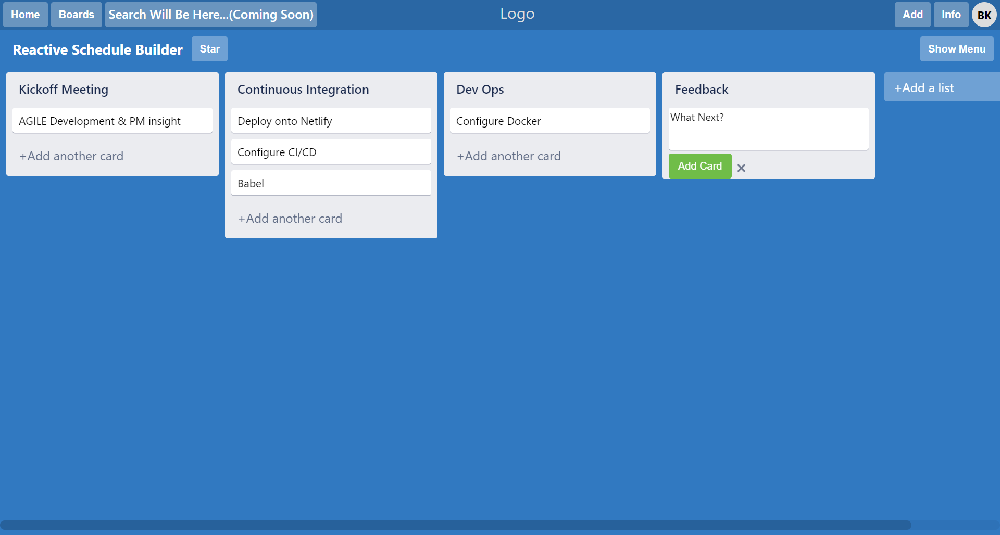

## Trello Copywork

This project is a work-in-progress, rebuilding many of the core features in [Trello.com](https://www.trello.com)
This project was bootstrapped with [Create React App](https://github.com/facebook/create-react-app)

## Core Features

The Core Features include...
_TODO: Determine Scope of Project to finalize all necessary features._

## Tech Stack

The UI was built with React, bootstrapped with Create React App
Database is built with **PostgreSQL**, with **Prisma** and **GraphQL**.
The GraphQL API is built with Node/**Apollo**.

## Installation

Clone the repository to your local computer, and `npm install`
_TODO: Determine procedures for database_
